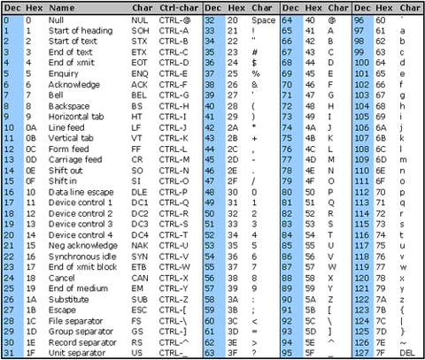

# 字元型態

在前面的章節，我們有提到char是字元型態，字元，想必是表示字的，那這型態到底是怎樣表示字？

### ASCII
以前美國定義了一個數值轉換成字的一張表，作為標準，我們稱其為ASCII，下面是詳細內容。



由於用的範圍較小，ascii編碼只需要1byte，所以char這型態為1byte型態。


### 非英文字元
這邊你肯定發現到，這邊只有定義英文字母，並沒有中文字，對的，中文自有另外一套編碼標準，可能使用超過1個byte儲存字元，像是Big-5阿，以及現在大家常用的Unicode萬國碼，詳細內容這邊不做過多贅述。

### 宣告方式

```cpp linenums="1"

#include <iostream>

int main(){

    char A_test = 41;
    char a_test = 'a';

    cout << A << a << endl;

    return 0;
}

```

```title="output"
Aa
```

第一個方式為直接給予宣告ascii的值，cout在輸出時，會把它轉成ascii對應的字元，也就是A。

第二種方式為告訴編譯器我這邊要給的值為字元，我們把要輸入的字元用單引號``\'``包起來，就告訴編譯器這是字元，而輸出時會把這個字元印出來。

所以結果就如下方output所述。

### 跳脫字元
在字串當中，我們用了``""``表示字串的內容範圍，但是如果今天我們想印``"``，該怎樣做？

使用跳脫字元阿！

```cpp linenums="1" title="跳脫字元範例"

#include <iostream>

int main(){


    cout << '\"' << endl;

    return 0;
}

```

除了這個，還有下面這些例子：

```cpp linenums="1" title="換行範例"

#include <iostream>

int main(){


    cout << '\n' << endl;

    return 0;
}

```

```cpp linenums="1" title="單引號範例"

#include <iostream>

int main(){


    cout << '\'' << endl;

    return 0;
}

```

## 練習

!!! success "reference"
    1.  [https://www.commfront.com/pages/ascii-chart](https://www.commfront.com/pages/ascii-chart)