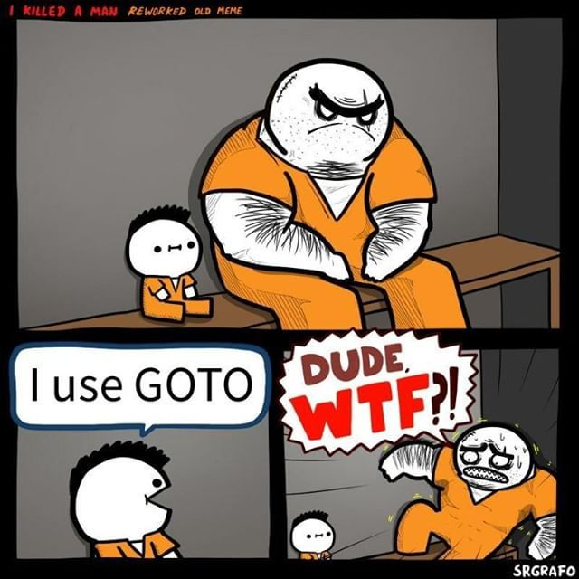

# 3. 流程控制

在程式當中，根據條件來控制程式的走向是很重要的，下方是我們會有範例程式講解相關用法。

## if、else if、else 用法


### if 的用法

if裡面會包住條件判斷句，只要條件是true就會跳進後面用``{}``包住的的程式

條件判斷句有下面幾個：

1. ``>`` 左邊是否大於右邊
2. ``>=`` 左邊是否大於或**等於**右邊
3. ``<`` 左邊是否小於右邊
4. ``<=`` 左邊是否大於或**小於**右邊
5. ``==`` 左邊是否等於右邊
6. ``!=`` 左邊是否**不等於**右邊
7. ``!`` 不，讓條件句true->false,false-> true


```c++
#include <iostream>

using namespace std;

int main(){

    int a;
    cin >> a;

    if(a > 0){
        cout <<  a << " bigger than or equal to 0 " << endl;
    }

    return 0;
}

```

這邊有個需要注意的部分，在c++中，我們會讓**非0值代表true**，也就是說，下方這個程式會有輸出:

```c++
#include <iostream>

using namespace std;

int main(){

    if(1){
        cout << "output here!" << endl;
    }

    return 0;
}

```
``` title="output"
output here!
```

???danger "常用的誤區"
    嘗試執行這段程式，你會發現不論輸入啥，都會印出``output here!``，這是因為，條件判斷句**使用兩個``=``**，這樣寫會造成，程式會先把a變成1，在丟進if判斷，導致每次執行a都會變成1，並跳進if裡面！

    ```c++
    #include <iostream>

    using namespace std;

    int main(){
        int a;
        cin >> a;

        if(a=1){
            cout << "output here!" << endl;
        }

        return 0;
    }

    ```

### else 的用法

你有沒有想過，如果要寫一個判斷奇數偶數的程式是不是可以這樣寫:

```c++
#include <iostream>

using namespace std;

int main(){
    int a;
    cin >> a;

    if(a%2 == 0){
        cout << "div by 2" << endl;
    }

    if( !(a % 2 == 0)){
        cout << "not div by 2" << endl;
    }

    return 0;
}

```
是不是感覺怪怪的！其實c++中有提供這樣的寫法，當if的條件不符合時，可以跳進去，寫法如下:

```c++
#include <iostream>

using namespace std;

int main(){
    int a;
    cin >> a;

    if(a % 2 == 0){
        cout << "div by 2" << endl;
    }else{
        cout << "not div by 2" << endl;
    }

    return 0;
}

```

### else if

那你有沒有想過else 後面是否能接上if？答案是可以

```c++
#include <iostream>

using namespace std;

int main(){
    int a;
    cin >> a;

    if(a % 2 == 0){
        cout << "div by 2" << endl;
    }else if (a % 3 == 0 ){
        cout << "div by 3" << endl;
    }
    else if (a % 5 == 0){
        cout << "div by 5" << endl;
    }else{
        cout << "not div by 2 or 3 or 5" << endl;
    }

    return 0;
}

```

## switch...case

## goto
你應該會聽過goto這語法，但我要把他跳過了，為什麼？因為他實在是太容易把你的程式搞得太難讀懂了！
